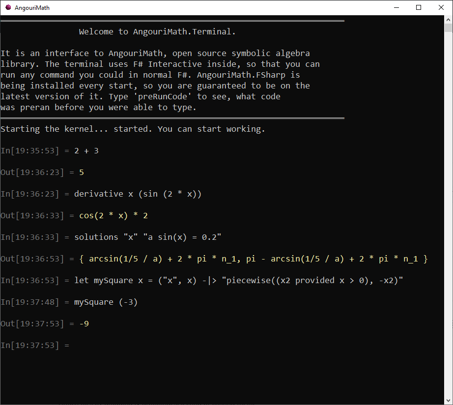

> **WARNING**: this repo has been deprecated. The last version of the terminal
> has been rewritten into F# and merged into the main repository of AngouriMath.
> 
> See the [pull request](https://github.com/asc-community/AngouriMath/pull/481).

## AngouriMath.Terminal

Currently: experimental repository for creating a terminal for AngouriMath based on F# Interactive.

